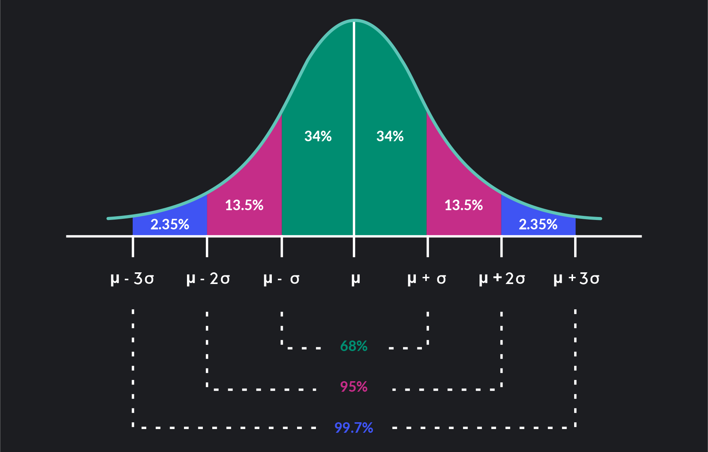

# Statistics concepts using Python (Jupyter notebook)

This repository is about explaining each statistics concept which I have learnt from "Probability & Statistics for Machine Learning & Data Science" coursera course.

The repository explains the concepts like Probability, Descriptive statistics, Probability distribution and Confidence interval. 

Also, it contains concepts with simple projects of Exploratory Data Analysis, Hypothesis testing, Chi-square test and ANOVA(Analysis of variance) test.

---

## Installation

* To use the jupyter notebook, please download all the github files or fork the files.
* The required libraries are in the `requirements.txt` file.
* To run the code, please install all the libraries by using the code `conda install --file requirements.txt` in conda or ` pip install -r requirements. txt` in your machine.

---
## Statisitcal concepts
The basic statisitics concepts has been explained in these notebooks followed by some problems.

* `1_Probability.ipynb` explains the probability formula, joint and disjoint events, product rule and birthday problem.
* `2_eda.ipyb`explains the way to analyse data and reach conclusions. Here, the `coaster_db.csv` data file is used and analysed.
* `3_Descriptive_statsh.ipynb` explains the application and importance of measuring the center of data.
* `4_Probability_distribution.ipynb` explains the mathematical theory and how to generate the distribution using `scikit-learn` library. 
* `5_Estimation.ipynb` explain the concept of point estiamtion, sampling and confidence interval.

---
## Projects
* `6_Hypothesis_testing.ipyb` explains the concpet of Hypothesis testing. It also includes
    1. `One sample T-test`  is perfomed to check whether the average profits of a fake data of Boeing Airlines is similar to overall airline industry.
    2. `Two sample T-test` is perfomred to check if profits of fake data of American airlines and Boding airlines are similar.
    3. `Paired T-test` is performed to check if the UI design of fake data of Airlines website could increase the time spent by users on the website. 
    4. `Type 1 and Type 2 error` concepts has been added and these will be used in confusion matrix in another Machine Learning projects.
* `7_Chi_test.ipyb` explains about the Chi-squared goodness-of-fit test and is performed to check whether the fake data of Primark monthly profits is similar to overall profits of clothing industry in Ireland.  Also, the project on dependency on monthly spending on dependence of their class is performed. 
* `8_ANOVA.ipynb` has the project of `One-way ANOVA` which is used to check if the mean of the groups are exactly same or not. 

## Results

The results are clearly explained at the end of Jupyter Notebook. Correspondingly, the hand-made calculations are compared with inbuilt function outputs.

---
## Credits

These notebooks are created for anyone  who wishes to learn about statistics the way I learnt. Also, I would like to give credits to

* `Probability & Statistics for Machine Learning & Data Science` course by deeplearning.ai
* `DataDaft` youtube channel
* `StatQuest` youtube channel